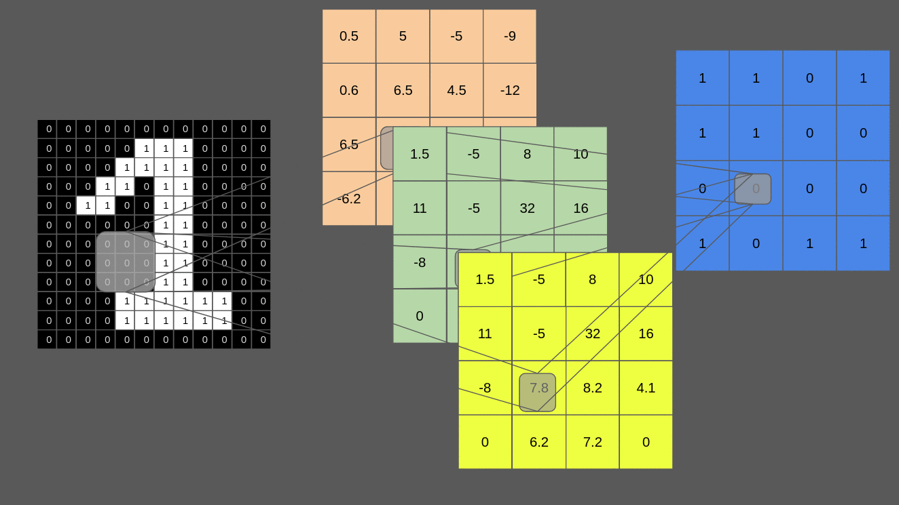

# Truth-Table-Deep-Convolutional-Neural-Network

This repository is the implementation Reproducibility part for submitted paper _Truth Table Deep Convolutional Neural Network, A New SAT-Encodable Architecture - Application To Complete Robustness_

In this work, we introduce Truth Table Deep Convolutional Neural Networks (TT-DCNNs), **a new family of SAT-encodable models featuring real-valued weights and real intermediate values as well as a highly interpretable conversion method.** The TT-DCNN architecture enables for the **first time all the logical classification rules to be extracted from a performant neural network** which can be then easily interpreted by anyone familiar with the domain. Therefore, this allows **integrating human knowledge in post-processing as well as enumerating all possible inputs/outputs prior to deployment in production**. We believe our new architecture paves the way between eXplainability AI (XAI) and formal verification. 

Our main contributions:

1. First, we define a new family of real-valued Deep Convolutional Neural Networks (DCNN) that can be encoded into SAT formulas: Truth Table Deep Convolutional Neural Network (TT-DCNN). Our TT-DCNN leverages its model formulation in the form of a truth table to allow weights and certain intermediate values to be real. To the best of our knowledge, this is the first method to encode a real-valued DCNN into SAT. For the first time, we can extract all the logic classification rules from a subfamily of DCNNs which allows a bridge between XAI and formal verification, while achieving sufficient natural accuracy for practical use. Indeed, the nature of the SAT conversion between TT-DCNN and BNN is intrinsically different: our method relies upon giving one SAT expression per 2D-CNN filter instead of one SAT expression per neuron. This global interpretability method is in sharp contrast with the previous limited BNNs and local DNNs explainability.

2. TT-DCNNs offer two main valuable conversion properties over BNNs. 

a) The first one allows us to integrate human knowledge in the post-processing:  we can now interpret the model inference with simple concepts, which enables to manually modify the 2D-CNN filter activation towards a desired goal. For example, we decided to focus on reducing overfitting and, to this end, we characterize TT-DCNN logic rules resulting from overfitting and propose a filtering approach, which increases the verifiable accuracy without decreasing the natural accuracy 

b) The second property is the possibility to compute all possible model inputs/outputs prior to deployment in production. In an adversarial setting, we can assess whether the input noise will propagate to the output. We can therefore disregard filters with no impact on the output. This leads to a lower formulas number of clauses and variables compared to BNNs which allows using generic SAT solvers and exact model counting solvers.

3. We apply our model to complete robustness verification. TT-DCNNs offer a good tradeoff between the state-of-the-art of BNN/SAT method and of real-valued DNN/MILP complete robustness verification methods. This is expected as our network is both real-weighted and SAT-convertible.  Our TT-DCNN model improves the verifiable accuracy by more than 2.5\% for high noise MNIST and by 0.5\% for the high noise of CIFAR10 compared to BNN/SAT method while decreasing the verification time by a factor of 9 for MNIST and 150 for CIFAR10 high noise compared to DNN/MILP methods. 


Here is a visualisation of 1 block of 2D-CNN: the first layer has 3 filters with real-valued weigths and intermediate values, and the second layer has one filter with with real-valued weigths and  binary values.



## Building

The code needs python >= 3.7, and  has only been tested on Ubuntu 18.04.2 LTS. The
code is known to work with pytorch 1.5.0.

[GANAK](https://github.com/meelgroup/ganak) is the Exact Model Counter used in
this work. Please install it in the main path of the repo.

## Usage

The pretrained
models and truth tables can be downloaded [here](https://drive.google.com/drive/folders/1vso485OSVgIuCHxzmOK2hLAWCNHcCluR?usp=sharing).
To run the verifier:

```
# verifying without filtering
python3 evaluation_general.py --modeltoeval normal --path_exp ./path_to/mnist_high_noise/ --attack_eps_ici 0.3 

# verifying with filtering
python3 evaluation_general.py --modeltoeval filtered --path_exp ./path_to/mnist_high_noise/ --attack_eps_ici 0.3 
```


